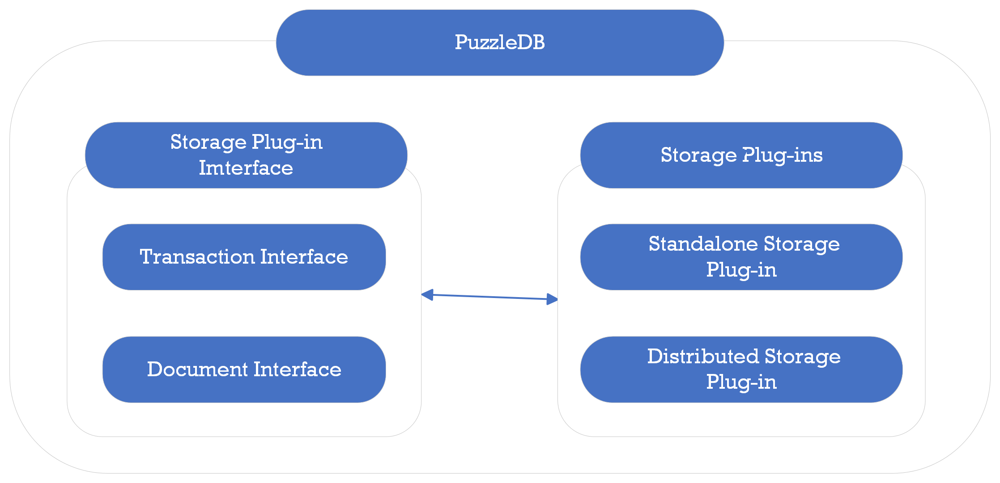

# Consistency Model

Concord is a multi‑data‑model database; storage layer modules are expected to satisfy ACID semantics through a common interface.

Concord defines its top-level storage plugin as a document model interface composed of transaction and document primitives.

<figure>

</figure>

While non‑ACID backends could be implemented, Concord strongly recommends ACID‑compliant ordered key‑value storage for correctness and predictable consistency.
